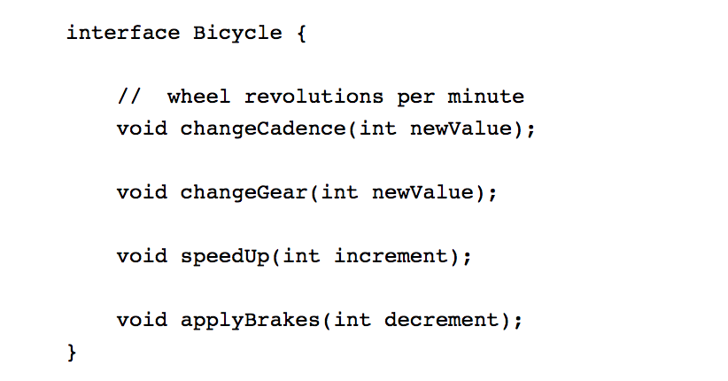

# Inheritance & Interfaces

## Cheatsheet

### Inheritance 
- Object-oriented programming allows classes to inherit commonly used state and behavior from other classes
- The syntax for creating a subclass is simple. At the beginning of your class declaration, use the `extends` keyword, followed by the name of the class to inherit from

> class MountainBike **extends** Bicycle

- This gives MountainBike all the same fields and methods as Bicycle yet allows its code to focus exclusively on the features that make it unique

### Interface
- an interface is a group of related methods with empty bodies

> implementing an interface allows a class to become more formal about the behavior it promises to provide

- Interfaces form a contract between the class and the outside world
-  If your class claims to implement an interface, all methods defined by that interface must appear in its source code before the class will successfully compile

### Package

- A package is a namespace that organizes a set of related classes and interfaces
- Conceptually you can think of packages as being similar to different folders on your computer

> The Java platform provides an enormous class library (a set of packages) suitable for use in your own applications. This library is known as the "Application Programming Interface", or "API" for short

